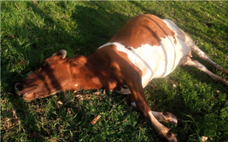

<blockquote style="background: #f2f3f4;">

To add your question press   in bottom corner 👇

</blockquote>

  
Let's start with some expert advice from ILRI...

<blockquote style="background: #D7F19F;">

### Milk fever is caused by slow calcium absorption during calving

When a cow is calving she will lose a lot of calcium from her blood into the milk. The cow will need to start absorbing more calcium from her bones and feed to replace the lost calcium. If a cow cannot absorb calcium quickly enough then she will get sick. This is milk fever.

Most cases occur between 48 hours before calving and 72 hours after calving. Milk fever is rare for first-calf heifers but becomes higher with each new calf.

  

  

    Source:
    
    <b>ILRI</b>
    
 <b>21</b>
      
    

  

</blockquote>

Though some farmers may think the opposite is correct, it may be important to **reduce the calcium intake** of affected cows before calving...

<blockquote style="background: #D7F19F;">

### Prevent milk fever by reducing calcium intake in the 3 weeks before calving

If you feed your cow too much calcium during the dry period then you will slow down her rate of calcium absorption. When she calves it will take her a couple of weeks to increase her rate of calcium absorption back up to the right levels. In the meantime she will become calcium deficient.

The daily requirement of a 600kg pregnant dry cow is about 40 grams of calcium and 30 grams of phosphorus.

    

  

    Source:
    
    <b>ILRI</b>
    
 <b>32</b>
      
    

  

</blockquote>

### Top Q&A from AFC members

Franche asked a key question relevant to many farmers...

<blockquote style="background: #6EA6A2;">

  ### Franche's Question

  What causes a cow to fall after giving birth.. Being unable to stand n what should I feed it not to occur again?

    

  

    Posted by:
    
    <b>Franche N</b>
    
 <b>12</b>
      
    

  

</blockquote>

A top answer we've selected comes from James...

<blockquote style="background: #96e58e;">

### Jame's Answer

Your cow falling down could be due to milk fever, injury to nerves or fracture.
  
How was calving process, smooth or laboured?
How many times have it calved?
What's it's demeanor?
    

  

    Posted by:
    
    <b>James W</b>
    
 <b>31</b>
      
    

  

</blockquote>

Our AFC opinion on this topic

<blockquote style="background: #D7F19F;">

### AFC opinion

If the problem is milk fever then avoid feeding it any high calcium salts during the dry period. If you are using salts then buy those that are specifically for dry cows.
  
Do not feed dry cows excess legumes or alfalfa as they are high in calcium. Grass hay, silage, cereals and maizestalks are all low in calcium and safe to feed to dry cows.
    

  

    Posted by:
    
    <b>Africa Farmers Club</b>
    
 <b>31</b>
      
    

  

</blockquote>

It is key for farmers to understand the **stages of milk fever**...

<blockquote style="background: #D7F19F;">

### The stages of milk fever

First 1 hour of milk fever: Standing but wobbly or twitching. Loss of appetite. Cold ears, dry mouth.
  
Next 1-12 hours of milk fever: Down on chest and drowsy
  
After 12 hours of milk fever: Down on side and unresponsive

    

  

    Source:
    
    <b>ILRI</b>
    
 <b>7</b>
      
    

  

</blockquote>

### Top Q&A from AFC members

Philip asked a key question relevant to many farmers...

<blockquote style="background: #6EA6A2;">

  ### Philip's Question

  I am a vet and often meets pregnant cows that will go down at almost eight months with poor response to calciject administration, who has handled the same and came up with good results?

    

  

    Posted by:
    
    <b>Philip M</b>
    
 <b>10</b>
      
    

  

</blockquote>

A top answer we've selected comes from Sammi...

<blockquote style="background: #96e58e;">

### Sammi's Answer

Milk fever aproach depends on its stage.The amount to inject i.v depends on the live weight of the cow to avoid calcium poisoning
  
At 1st stage oral calcium like animatic calcium from osho chemicals 100mls per day plus a good D.C.P helps.
    

  

    Posted by:
    
    <b>Sammi M</b>
    
 <b>26</b>
      
    

  

</blockquote>

Consider oral calcium...

<blockquote style="background: #D7F19F;">

### AFC opinion

1 in 3 cows who get a calcium injection for milk fever will relapse in the following hours or days. Using oral calcium after the injection can reduce the chance of a relapse by 60%.
    

  

    Posted by:
    
    <b>Africa Farmers Club</b>
    
 <b>26</b>
      
    

  

</blockquote>

### Real Farmer Stories

Betty's experience with Milk fever...

<blockquote style="background: #96e58e;">

  

  
  

    
  
  "What a Miracle working God!!!!! Finally the cow has risen up."

  
    

  

    Posted by:
    
    <b>Betty K</b>
    
 <b>49</b>
      
    

  

</blockquote>

---

### Read more topics
There are number of other important topics in this guide:

* [Milk Fever Part 2](/about) ⭐ - More guidance on milk fever
* [ECF Disease](/about)  ⭐- Know what to look out for
* [Advice on market prices](/about)  ⭐- Market data on on sales in Kenya
